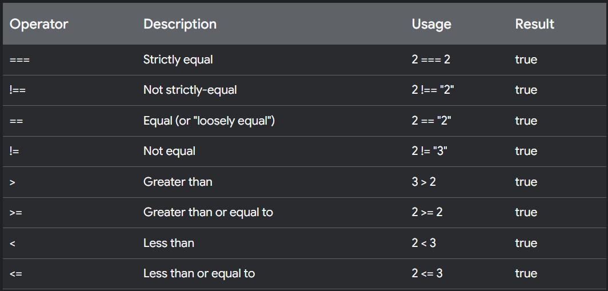

# Comparison Operators and Control Flow

## Comparison Operators
- Comparison operators compare the values of two operands and evalute whether the statment they form is `true` or `false`.
- Two of the most frequently-used comparison operators are `==` for loose equality and `===` for strict equality.
    - `==` performs a loose comparison between two values by coercing the operands to matching data types, if possible.
    - The same is true of `!=`, which returns `true` only if the oeprands being compared aren't loosely equal.
    - Strict comparisons using `===` or `!==` don't perform type coercion. For a strict comparison to evaluate to `true`, the values being compared must have the same data type.

- All values in JavaScript are implicitly `true` or `false`, and can be coerced to the corresponding boolean value.
- Use the logical AND (`&&`), OR (`||`), and NOT (`!`) operators to control the flow of a script based on the evaluation of two or more conditional statements.
    - The NOT operator (`!`) converts a value to a boolean, then flips it. Using double NOT (`!!`) is a quick way to coerce any value to its actual boolean form without flipping it.
    - The AND operator (`&&`) returns the first falsy value it finds, or the last value if all are truthy. In boolean comparisons, it's only `true` if both operands and truthy.
    - The OR operator (`||`) returns the first trutthy value it finds, or the last value if all are falsy. In boolean comparisons, it's     true` if either operand is truthy.
- Nullish coalescing (`??`) returns the first value unless it's `null` or `undefined`, otherwise it returns the second.
    - `??` differs from `||` because it only checks for `null`/`undefined`, not all falsy values like `0` or `false`.
- Logical AND assignment (`&&=`) updates a variable only if it's truthy.
- Logical OR assignment (`||=`) updates a variable only if it's falsy.

## Control Flow